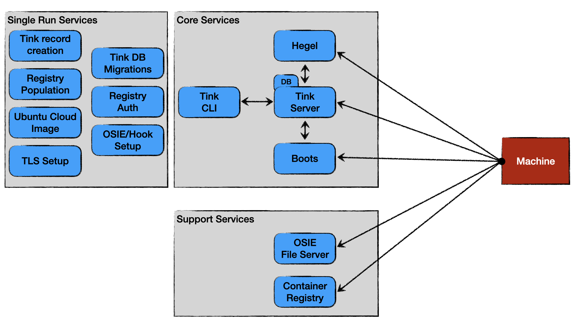

# Contributor Guide

Welcome to the Tinkerbell Sandbox! We are really excited to have you.
Please use the following guide on your contributing journey.
Thanks for contributing!

## Table of Contents

- [Context](#Context)
- [Architecture](#Architecture)
- [Prerequisites](#Prerequisites)
  - [DCO Sign Off](#DCO-Sign-Off)
  - [Code of Conduct](#Code-of-Conduct)
- [Linting](#Linting)

---

## Context

The Tinkerbell Sandbox is a repo that handles the standing up a Tinkerbell stack in many different infrastructure environments.
Its goal is to be **_"The easiest way to setup the Tinkerbell Stack"_**.

There are two major areas of responsibility.

1. Stand up of the Tinkerbell application stack
   - Handled by Docker Compose ([deploy/compose/docker-compose.yml](../deploy/compose/docker-compose.yml))
2. Stand up of infrastructure to support the Tinkerbell application stack
   - [Vagrant](../deploy/vagrant/Vagrantfile)
   - [Terraform](../deploy/terraform/main.tf)

## Architecture

<details>
   <summary>Diagram</summary>



</details>

The sandbox architecture can be broken down into 3 distinct groups.

1. Core Services

   - [Tink Server](https://docs.tinkerbell.org/services/tink-server/)
     - GRPC Server that holds hardware, template, and workflows
   - Tink DB
     - Persistent data store for Tink Server
   - [Tink CLI](https://docs.tinkerbell.org/services/tink-cli/)
     - Tink Server client
   - [Boots](https://docs.tinkerbell.org/services/boots/)
     - DHCP, TFTP for ipxe binary download, HTTP for ipxe script download
   - [Hegel](https://docs.tinkerbell.org/services/hegel/)
     - Metadata service for use in workflow execution

2. Support Services

   - [OSIE/Hook File Server](https://docs.tinkerbell.org/services/osie/)
     - Basic file server for kernel, initramfs, self signed TLS pem file, Ubuntu cloud image, OSIE scripts
   - [Container Registry](https://docs.tinkerbell.org/services/registry/)
     - Local/Internal container registry required for Tink Worker

3. Single Run Services
   - Tink Record Creation
     - This [script](../deploy/compose/manifests/apply_manifests.sh) that creates Tink records from templated files ([hardware](../deploy/compose/manifests/hardware), [template](../deploy/compose/manifests/template), and workflow)
   - Tink DB Migrations
     - Builtin functionality to the Tink Server binary that will create DB schemas, tables, etc
   - TLS Setup
     - This [script](../deploy/compose/tls/generate.sh) that handles creating the self-signed TLS certificates for the Tink Server and the Container Registry (the same certs are shared for both).
       Valid domain names are defined in the [csr.json](../deploy/compose/tls/csr.json) file. By default the value of `TINKERBELL_HOST_IP` in the [.env](../deploy/compose/.env) file is added as a valid domain name.
       This addition happens via the [generate.sh](../deploy/compose/tls/generate.sh) script.
   - Registry Auth
     - This container (named `registry-auth` in the [docker-compose.yml](../deploy/compose/docker-compose.yml)) creates the user/passwd pair for use to login to the container registry.
       Defaults to admin/Admin1234.
       These can be customized by setting `TINKERBELL_REGISTRY_USERNAME` and `TINKERBELL_REGISTRY_PASSWORD` in the [.env](../deploy/compose/.env) file.
   - Registry Image Population
     - This [script](../deploy/registry/upload.sh) uploads images to the local/internal container registry, including the tink-worker image.
       Any image needed in a workflow will need to be added to the [registry_images.txt](../deploy/compose/registry/registry_images.txt) file.
       The [registry_images.txt](../deploy/compose/registry/registry_images.txt) file should not contain a final newline and each line must have the form of `<image_name>space<image_name>`
       ```bash
       quay.io/tinkerbell/tink-worker:latest tink-worker:latest
       ```
   - OSIE/Hook Setup
     - This [script](../deploy/compose/osie/lastmile.sh) handles downloading Hook (or OSIE), extracting it, and placing it in the path ([deploy/compose/state/misc/osie/current](../deploy/compose/state/misc/osie/current)) that the compose service `osie-bootloader` uses for serving files.
       To use OSIE instead of Hook, update the `deploy/compose/.env` by setting `OSIE_DOWNLOAD_URL` to an OSIE download URL and by setting `TINKERBELL_USE_HOOK` to false.
       FYI, currently only an x86_64 Hook is published so only x86_64 machines can be provisioned with the sandbox using Hook.
   - Ubuntu Image Setup
     - This [script](../deploy/compose/ubuntu/setup_ubuntu.sh) handles downloading the Ubuntu focal cloud `.img` file and [converting it to a raw image](https://docs.tinkerbell.org/deploying-operating-systems/examples-ubuntu/).
       This will be used with workflow action [`quay.io/tinkerbell-actions/image2disk:v1.0.0`](https://artifacthub.io/packages/tbaction/tinkerbell-community/image2disk).

## Prerequisites

Before contributing, please be sure to complete the following.

### DCO Sign Off

Please read and understand the DCO found [here](DCO.md).

### Code of Conduct

Please read and understand the code of conduct found [here](https://github.com/tinkerbell/.github/blob/main/CODE_OF_CONDUCT.md).

## Linting

To execute linting, run:

```bash
./.github/workflows/ci-non-go.sh
```
